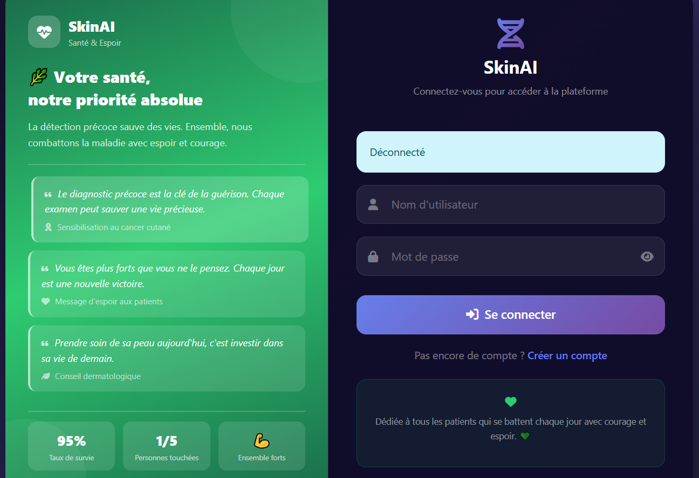
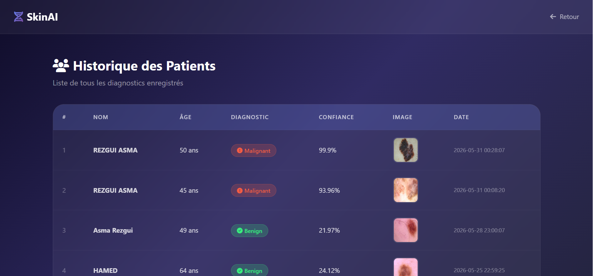

# SkinAI - Application de Détection du Cancer Cutané

## Description

SkinAI est une application web développée dans le cadre du module 
Introduction à l'IA à l'ENSTAB. Elle permet aux professionnels de 
santé de détecter les lésions cutanées suspectes en soumettant une 
image et d'obtenir un diagnostic automatique basé sur un modèle 
d'apprentissage profond VGG16.

L'application offre un espace sécurisé où chaque médecin peut gérer 
ses propres patients, consulter l'historique des analyses et suivre 
les résultats sous forme de statistiques.

---

## Fonctionnalités

- Connexion et création de compte sécurisés
- Analyse d'images de lésions cutanées par intelligence artificielle
- Résultat du diagnostic avec un taux de confiance en pourcentage
- Historique des patients propre à chaque compte
- Statistiques et graphiques des diagnostics effectués
- Rapport de résultat imprimable
- Conseils de santé et messages de sensibilisation

---

## Captures d'écran

### Page de Connexion


### Tableau de Bord


### Formulaire d'Analyse


### Résultat du Diagnostic


### Historique des Patients


---

## Technologies utilisées

- Python et Flask pour le backend
- TensorFlow et Keras avec le modèle VGG16 pour l'intelligence artificielle
- MySQL pour la base de données
- Bootstrap 5 et CSS pour l'interface utilisateur
- Chart.js pour les graphiques statistiques
- XAMPP comme serveur local

---

## Installation et lancement

Cloner le projet :
```bash
git clone https://github.com/fetensaidi/SKIN_CANCER_APP.git
cd SKIN_CANCER_APP
```

Installer les bibliothèques nécessaires :
```bash
pip install flask tensorflow numpy mysql-connector-python opencv-python Pillow
```

Démarrer XAMPP et lancer MySQL, puis ouvrir phpMyAdmin et exécuter 
le fichier database.sql pour créer la base de données.

Placer le fichier vgg16_malignant_vs_benign.h5 dans le dossier model. 
Ce fichier n'est pas inclus dans le dépôt car il dépasse la limite 
de taille autorisée par GitHub.

Lancer l'application :
```bash
python app.py
```

Ouvrir le navigateur et accéder à :
